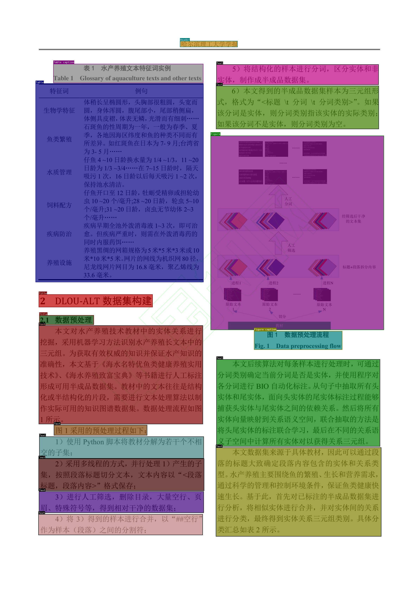
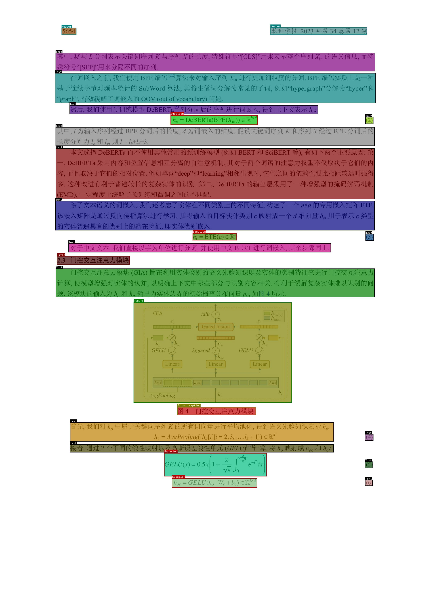
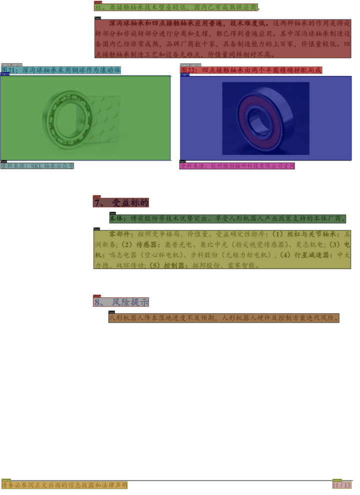
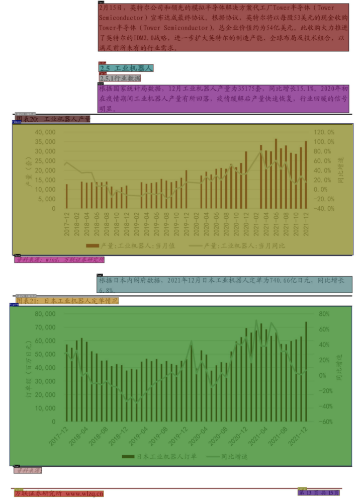
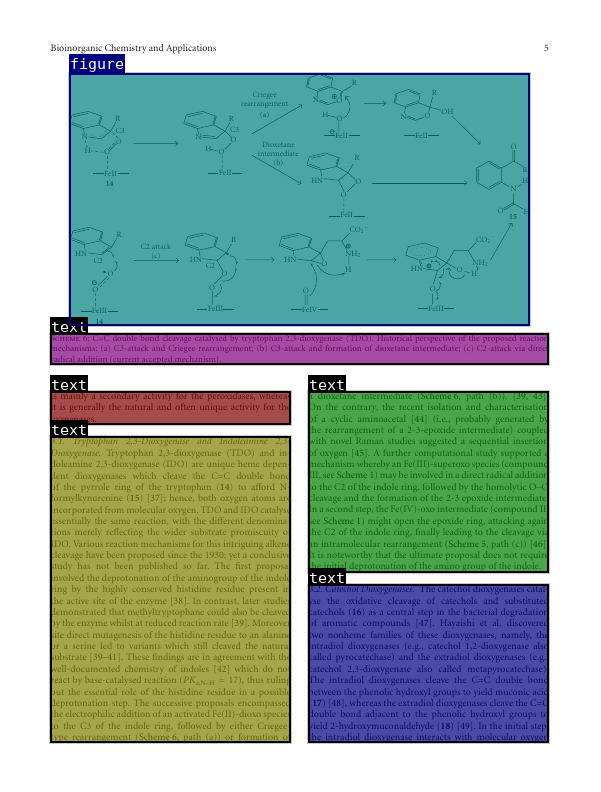
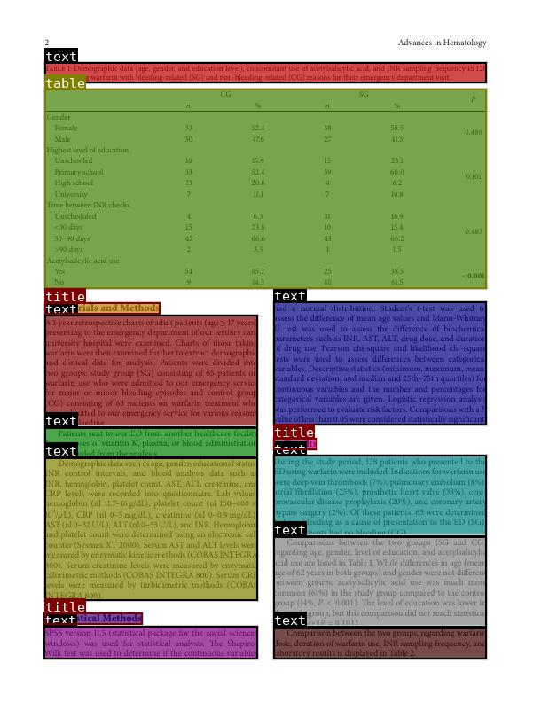

# 360LayoutAnalysis

[Chinese](./README.md)

## I. Background

In today's digital age, document layout analysis is one of the key steps in information extraction and document understanding. Document layout analysis, also known as document image analysis or document layout analysis, refers to the process of identifying and extracting text, images, tables, and other elements from scanned document images. This technology has extensive applications in fields such as automated document processing, electronic data exchange, and digitization of historical documents.
Traditional document layout analysis models often find it difficult to accurately distinguish paragraphs and other layout elements in documents, which limits the further processing and utilization of document information. The development of deep learning and pattern recognition technologies has brought new opportunities for document layout analysis. By training datasets, the model's understanding of document structure can be improved. However, high-quality annotated datasets are the foundation for training effective models.
In document layout analysis, refined annotation is very necessary, among which paragraph annotation is particularly crucial because it directly affects the semantic understanding and information extraction of the text. Currently, in the field of layout analysis, as far as we know, in paper scenarios, previous open-source datasets such as CDLA (A Chinese document layout analysis) lack annotation of paragraph information; The layout analysis model in the research report scenario is still relatively lacking.
Therefore, in order to solve this problem, we manually annotated the paper documents for fine-grained label transformation and data optimization, and constructed a fine-grained layout analysis dataset for research report scenarios. It is best to use these annotated datasets to train multiple new Chinese document layout analysis models, which performed well on the **closed test set**.
In this open source project, we have prioritized the development of lightweight model weights and corresponding label systems for page analysis in two scenarios: **paper** and **research report**. The aim is to identify paragraph boundaries and other information in documents, accurately distinguish text, images, tables, formulas, and other elements, and ultimately promote industrial development.

## II. Usage

- Weights download link: [🤗LINK](https://huggingface.co/qihoo360/360LayoutAnalysis)

- Usage:

  The open-source weights are trained with `yolov8`, and the prediction method is as follows:

  ```python
  from ultralytics import YOLO
  
  image_path = ''  # Path to the image to be predicted
  model_path = ''  # Path to the weights
  model = YOLO(model_path)
  
  result = model(image_path, save=True, conf=0.5, save_crop=False, line_width=2)
  print(result)
  
  print(result[0].names)         # Output the id to label map
  print(result[0].boxes)         # Output all detected bounding boxes
  print(result[0].boxes.xyxy)    # Output the top-left and bottom-right coordinates of all detected bounding boxes
  print(result[0].boxes.cls)     # Output the id corresponding to the class of all detected bounding boxes
  print(result[0].boxes.conf)    # Output the confidence of all detected bounding boxes
  ```

## III. Layout Analysis

### 3.1 Academic Paper Scenario

- Label Categories

  | Element        | Name                  |
  | -------------- | --------------------- |
  | Text           | Main Text (Paragraph) |
  | Title          | Title                 |
  | Figure         | Image                 |
  | Figure caption | Image Caption         |
  | Table          | Table                 |
  | Table caption  | Table Caption         |
  | Header         | Header                |
  | Footer         | Footer                |
  | Reference      | Reference             |
  | Equation       | Equation              |

- Example

<div align="center">
    
    
</div>


### 3.2 Research Report Scenario

- Label Categories

  | Element        | Name                  |
  | -------------- | --------------------- |
  | Text           | Main Text (Paragraph) |
  | Title          | Title                 |
  | Figure         | Image                 |
  | Figure caption | Image Caption         |
  | Table          | Table                 |
  | Table caption  | Table Caption         |
  | Header         | Header                |
  | Footer         | Footer                |
  | Toc            | Table of Contents     |

- Example

<div align="center">
    
    
</div>


### 3.3 publaynet

- Label Categories

  | Element | Name                  |
  | ------- | --------------------- |
  | text    | Main Text (Paragraph) |
  | title   | Title                 |
  | figure  | Image                 |
  | list    | List                  |
  | table   | Table                 |

- Example

<div align="center">
    
    
</div>

### 3.4 General Layout

- Label category

  | Element  | Name      |
  | -------- | --------- |
  | Text     | Main text |
  | Title    | Title     |
  | Figure   | Figure    |
  | Table    | Table     |
  | Equation | Equation  |
  | Caption  | Image Caption/Table Caption |

  

## License

This project utilizes certain datasets and checkpoints that are subject to their respective original licenses. Users must comply with all terms and conditions of these original licenses. The content of this project itself is licensed under the [Apache license 2.0](./LICENSE.txt).

## License

The source code of this repository follows the open-source license Apache 2.0. The 360LayoutAnalysis model open-source model supports commercial use. If you need to use this model and its derivative models for commercial purposes, please apply through the email ([360ailab-nlp@360.cn](mailto:360ailab-nlp@360.cn)), and see the specific license agreement in ["360LayoutAnalysis Model Open Source Model License"](./360LayoutAnalysis开源模型许可证.txt).
